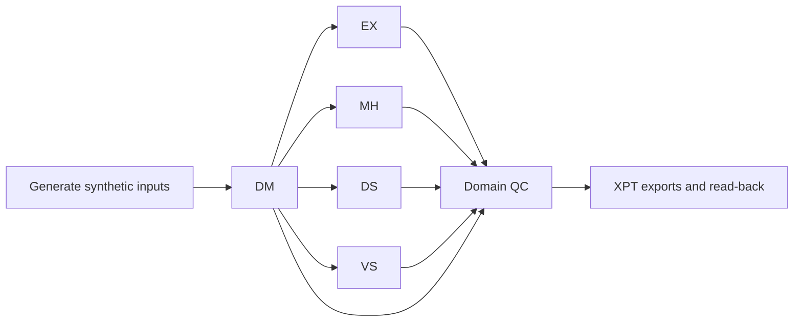

# Clinical SDTM-Style Programming & Validation in R


A reproducible **synthetic-data demonstration** of clinical domain programming in R. This repository builds five **SDTM-style** domains—Demographics (DM), Exposure (EX), Medical History (MH), Disposition (DS), and Vital Signs (VS)—and runs programmatic quality checks and SAS Transport (`.xpt`) read-back tests.

> **Portfolio and scope:** This is a new educational recreation of general SDTM programming methods. It contains no original trial data, proprietary specifications, reference XPT files, real participant records, or study-specific identifiers. It is **not an official CDISC-conformant submission** and does **not** claim independent validation against a primary programmer's outputs.

## Project Highlights

- Creates deterministic, fully synthetic enrollment, dosing, medical history, disposition, and vital signs inputs.
- Derives subject identifiers, reference treatment dates, and demographic variables for DM.
- Programs EX, MH, DS, and VS, including ISO 8601 character dates and relative study days where applicable.
- Uses consistent keys, domain labels, and output sorting.
- Exports five demonstration datasets with `haven::write_xpt()` and saves `.rds` working copies.
- Checks subject uniqueness, domain/source row reconciliation, reference-date derivations, day calculation, and output XPT read-back.

## Workflow



| Domain | Demonstrated programming |
| --- | --- |
| DM | Subject-level demographics, treatment arm, reference start and end dates |
| EX | Treatment exposure records and relative study days |
| MH | History records and optional timing relative to treatment |
| DS | Study milestones and subject disposition |
| VS | Vital signs by subject, visit, test, value, and unit |

## Repository Structure

```text
clinical-sdtm-r-workflow/
├── R/
│   ├── 00_helpers.R
│   ├── 01_generate_synthetic_data.R
│   ├── 02_dm.R
│   ├── 03_ex.R
│   ├── 04_mh.R
│   ├── 05_ds.R
│   ├── 06_vs.R
│   └── 07_validation.R
├── data/
│   └── synthetic/        # Generated inputs; ignored by Git
├── outputs/.gitignore              # Generated XPT, RDS, QC report; ignored by Git
├── run_demo.R
└── README.md
```

## Running Locally

Install **R** and the required package:

```r
install.packages("haven")
```

Open this project folder as the working directory in RStudio, then run:

```r
source("run_demo.R")
```

The run creates synthetic source CSVs in `data/synthetic/`, builds five demonstration domains, writes XPT and RDS files to `outputs/`, and saves a `validation_summary.csv` QC report. Inspect the console and report; the workflow stops if any required check fails.

**Execution status:** Code prepared for local testing. Update this statement only after running `source("run_demo.R")` successfully on your machine.

## Quality Control and Limitations

Validation covers consistency and invariants of this *synthetic demonstration*. XPT read-back confirms readability, expected record counts, and column ordering. This is not an independent comparison to confidential reference datasets, full CDISC validation, or a substitute for a protocol-specific SDTM specification. Clinical derivations, controlled terminology, date handling, and metadata must be adapted and validated before real trial use.

## Skills Demonstrated

R · Clinical data programming · SDTM concepts · DM / EX / MH / DS / VS · Synthetic clinical data generation · ISO dates and study-day derivation · SAS Transport export · Programmatic QC · Reproducible workflows

## Author

**Rhutika Patil** — M.S. Bioinformatics, North Carolina State University  GitHub: [Rhutikapatil](https://github.com/Rhutikapatil)  LinkedIn: [rhutika-patil](https://www.linkedin.com/in/rhutika-patil)
